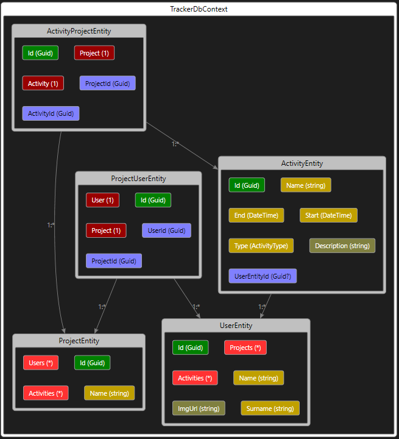
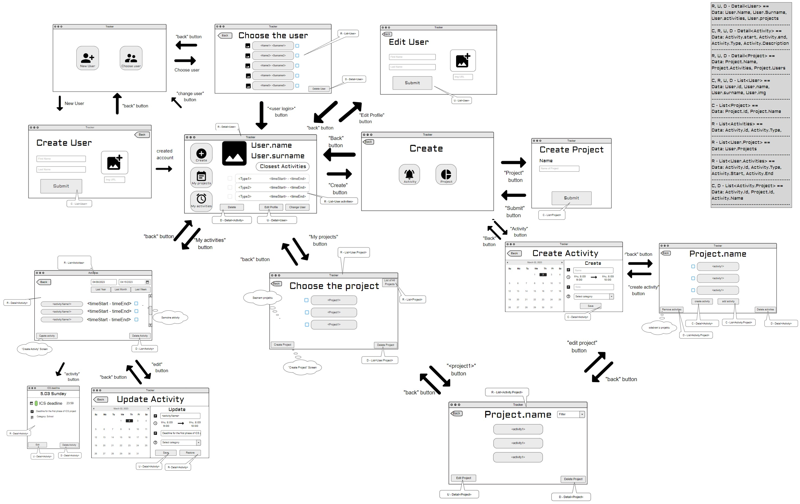

# Tracker

## ER Diagram

## Wireframe
[Odkaz](https://app.moqups.com/iVb6rlHYNq6hDliQ0AVvcVfNsY2NfBnI/view/page/ad64222d5 ) na použitý nástroj.

## Final Evaluation
    84/100

## Phase 1 functionality.
1. Logical design of classes in the form of the above and generated ER diagram.
     * ER diagram generated using Visual Studio IDE
     * The basic design of the data models is shown below.
2. Use of abstraction, encapsulation, polymorphism in the field of databases.
3. Versioning in GIT in logical parts in the form of commits on Azure.
     * Commit to the Main branch only with the help of approved pull requests.
4. Wireframes (logical structure, user-friendliness, not the quality of graphic processing)
     * The wireframe is shown above in the README with a link to the tool used.
5. Using the Entity Framework Core - Code First approach to create a database from entity classes.
     * This approach is in the *Tracker.DAL/Migrations* project.
6. Existence of database migrations (at least InitialMigration).
     * Automatically generated migrations are in the *Tracker.DAL/Migrations* project.

## Phase 2 functionality.
1. Fixing bugs and incorporating comments we received as part of the Phase 1 evaluation
2. Design and functionality of repositories
3. Design and functionality of facades
     * Facade activities for the user can be linked via UserId
     * User projects are accessed via includeNavigationPath
4. Application coverage tests
     * We have shown that repositories really work
5. Encapsulation of database entities under a facade layer that does not promote them above, but maps them to models/DTOs
6. Functional build in Azure DevOps
7. Test result in Azure DevOps after build
8. Wireframe update (current version below the link)
     * Added model design
9. Update database and ER
10. Update migrations

## Project structure

### Tracker.DAL.Tests
* Unit tests for database testing.
* The section from which the project should be launched.
* Currently 18 functional tests that test databases.

### Tracker.Common.Tests
* Helper library for Unit tests.

### Tracker.DAL
* A data structure holding database connections and a structure of data modules.
* Database migration is located here

### Data structure (ViewModels)

** Deviation from specification: **
* The link between project and activity is m : n instead of 1 : n.

#### UserEntity
* Guid - Id
* string - Name
* string - Surname
* ImgUrl
* (ActivityEntity) - Activities
* (ProjectUserEntity) - Projects

#### ActivityEntity
* Guid - Id
* string - Name
* DateTime - Start
* DateTime - End
* ActivityType - Type
* string - Description

#### ProjectUserEntity
* Guid - Id
* Guid - UserId
* Guid - ProjectId
* string - Name
* (ProjectEntity) - Project
* (UserEntity) - User

#### ActivityProjectEntity
* Guid - Id
* Guid - ProjectId
* Guid - ActivityId
* (ProjectEntity) - Project
* (ActivityEntity) - Activity

#### ProjectEntity
* Guid - Id
* string - Name
* (ActivityProjectEntity) - Activities
* (ProjectUserEntity) - Users

This README also serves as documentation.